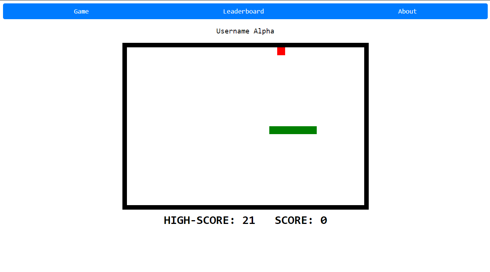

# Crispy Sniffles
This is a full stack project. I used react for the frontend. MongoDB and Express.js for the backend. It comprises of the following features
- Sign In/Sign Up
- Snake game with current score and high score
- Leaderboard (Under work)

Deployed using Netlify(frontend) and Railway(backend).
# How to run the project Locally?
### Prerequisites: 
- latest version of nodejs
- mongoDB URI (sorry I can't reveal mine)
### Steps
1. Clone the repo
2. For the frontend just go to the directory
    - create a .env.local file with the following key-values:
        - VITE_API_URL=`http://localhost:5000`
    - Run `npm install`
    - Run `npm run dev`
3. For backend
    - create a .env.local file with the following key-values:
        - MONGO_URI = `your-mongo-URI`
        - JWT_SECRET = `"any-32-char-string"`
    - navigate to /backend
    - Run `npm install`
    - Run `npm run devstart`
4. In the browser navigate to 'localhost:5173'

# Access the website on the internet 
### You can access it [here](https://crispy-sniffle.netlify.app).

### P.S: I made this within 2 days, and deployed it.